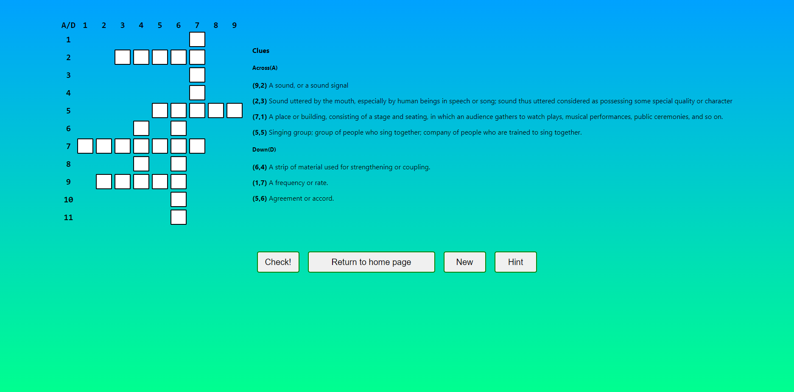

<table>
  <tr>
    <td></td>
    <td></td>
    <td></td>
  </tr>
  <tr>
    <td></td>
    <td></td>
    <td></td>
  </tr>
</table>

# Lexicross
A little english project. We made a crossword game, using React and flask.

# Installation
After cloning, run the following commands. Also make sure you have NodeJS installed.
```bash
npm install
npm start
```

# How it works
It's a pretty simple process, on the main page, you select a theme. And then you have 2 options : learn or play.
- Learn : A page with words and their defition, on a selected theme.
- Play : Generates a crossword game for the theme you selected.
You can use Hints to get the first letter of the words.
